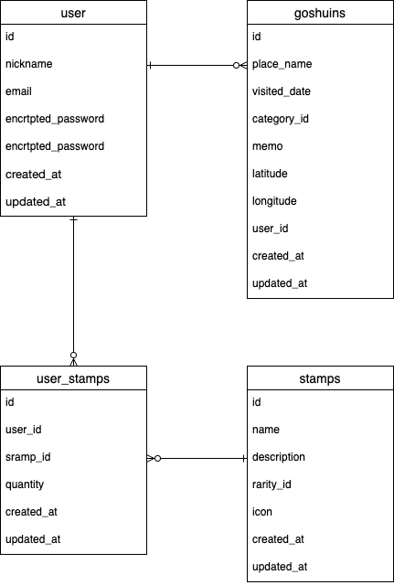

# 御朱印クエスト

## アプリケーション概要

御朱印クエストは、神社やお寺でいただいた御朱印を、写真・参拝日・場所・メモと一緒に記録できるアプリケーションです。

登録した御朱印は一覧で確認できるだけでなく、訪れた場所をマップ上に表示することで、自分がどこで御朱印を集めたのかを視覚的に振り返ることができます。

また、御朱印の登録数に応じてレベルが上がる仕組みや、所持スタンプを確認できる機能を取り入れ、御朱印集めをゲーム感覚で楽しめるようにしました。

## アプリケーションを作成した背景

御朱印を集め始めた際に、後から見返したとき「どこの神社やお寺でいただいた御朱印なのか」「いつ参拝したのか」が分からなくなることがありました。

また、御朱印集めは記録するだけでなく、訪れた場所や思い出を振り返る楽しさもあると感じました。

そこで、御朱印の写真だけでなく、参拝日、神社・お寺の名前、メモ、位置情報を一緒に記録できるアプリを作成しようと考えました。

さらに、登録数に応じてレベルアップする要素や、所持スタンプを確認できる要素を加えることで、継続して使いたくなるようなアプリを目指しています。

## URL

[御朱印クエスト](https://goshuin-app-jvjr.onrender.com)

## テスト用アカウント

メールアドレス:111@111
パスワード:123456

## 利用方法

### 御朱印を登録する

1. ユーザー新規登録またはログインをします。
2. 御朱印登録ページから、神社・お寺の名前、参拝日、種類、写真、メモを入力します。
3. 登録ボタンを押すと、御朱印の記録が保存されます。
4. 登録した御朱印の数に応じて、ユーザーのレベルが上がります。

### 御朱印を確認する

1. 一覧ページから、登録した御朱印を確認できます。
2. 詳細ページで、御朱印の写真、参拝日、神社・お寺名、メモ、参拝場所を確認できます。
3. マップページでは、御朱印を登録した場所を地図上で確認できます。

### 御朱印集めを楽しむ

1. 登録した御朱印の数に応じて、ユーザーのレベルが上がります。
2. 一覧ページで現在のレベルや登録数を確認できます。
3. 訪れた場所をマップ上で確認し、御朱印集めの記録を視覚的に振り返ることができます。

### MVPとして実装する機能

* ユーザー管理機能
* 御朱印投稿機能
* 画像投稿機能
* 御朱印一覧表示機能
* 御朱印詳細表示機能
* 御朱印編集機能
* 御朱印削除機能
* 登録数に応じたレベルアップ機能
* マップ表示機能
* マーカー表示機能

### 実装途中の機能

* 所持スタンプ一覧表示機能
* スタンプのレア度表示機能

### 今後実装したい機能

* 御朱印検索機能
* 神社・お寺の絞り込み機能
* 御朱印登録時のランダムスタンプ獲得機能
* スタンプ獲得結果画面

## データベース設計

### users テーブル

## ER図



| Column             | Type   | Options                   |
| ------------------ | ------ | ------------------------- |
| nickname           | string | null: false               |
| email              | string | null: false, unique: true |
| encrypted_password | string | null: false               |

#### Association

* has_many :goshuins
* has_many :user_stamps
* has_many :stamps, through: :user_stamps

### goshuins テーブル

| Column       | Type       | Options                        |
| ------------ | ---------- | ------------------------------ |
| place_name   | string     | null: false                    |
| visited_date | date       | null: false                    |
| category_id  | integer    | null: false                    |
| memo         | text       |                                |
| latitude     | decimal    |                                |
| longitude    | decimal    |                                |
| user         | references | null: false, foreign_key: true |

#### Association

* belongs_to :user
* has_one_attached :image

### stamps テーブル

| Column      | Type    | Options     |
| ----------- | ------- | ----------- |
| name        | string  | null: false |
| description | text    | null: false |
| rarity_id   | integer | null: false |
| icon        | string  | null: false |

#### Association

* has_many :user_stamps
* has_many :users, through: :user_stamps

### user_stamps テーブル

| Column   | Type       | Options                        |
| -------- | ---------- | ------------------------------ |
| user     | references | null: false, foreign_key: true |
| stamp    | references | null: false, foreign_key: true |
| quantity | integer    | null: false, default: 1        |

#### Association

* belongs_to :user
* belongs_to :stamp

## 画面遷移図

作成後に記載予定です。

## 開発環境

* Ruby
* Ruby on Rails
* MySQL
* JavaScript
* HTML
* CSS
* GitHub
* Render


## ローカルでの動作方法

以下のコマンドを順に実行してください。

```bash
git clone リポジトリURL
cd アプリケーション名
bundle install
rails db:create
rails db:migrate
rails s
```

ブラウザで以下にアクセスします。

```text
http://localhost:3000
```

## 工夫したポイント

* 御朱印の写真だけでなく、参拝日、種類、メモ、位置情報を一緒に記録できるようにしました。
* Leafletを使用し、地図をクリックして参拝場所を登録できるようにしました。
* 登録した御朱印の場所をマップ上にマーカー表示し、訪問場所を視覚的に振り返れるようにしました。
* 御朱印の登録数に応じてレベルが上がる仕組みを実装し、継続して使いたくなる要素を加えました。
* 所持スタンプ一覧ページを作成し、スタンプ画像、レアリティ、所持枚数を確認できるようにしました。